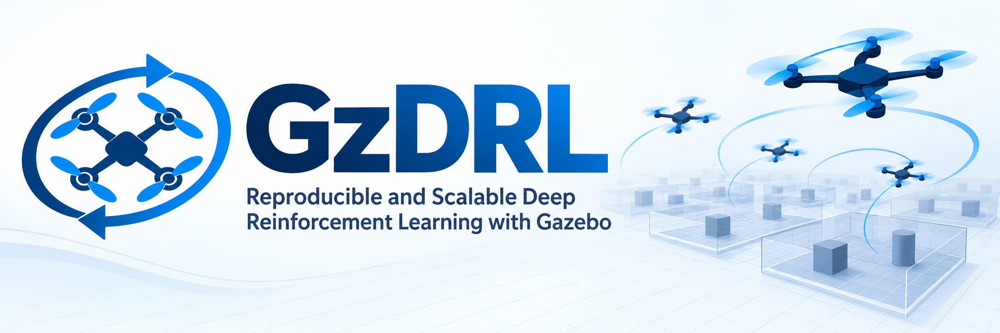
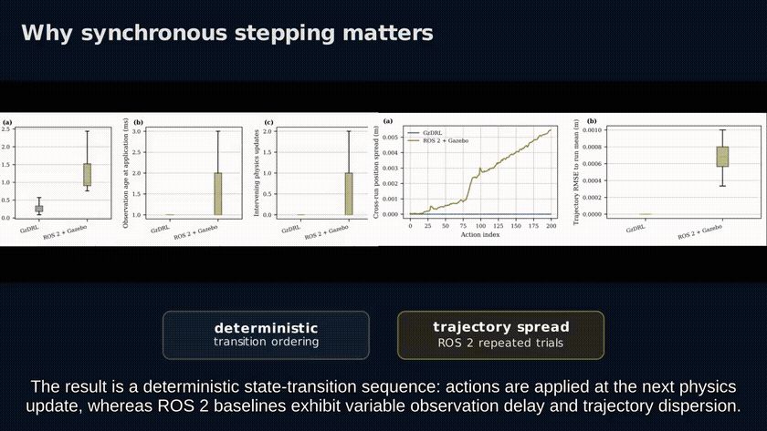
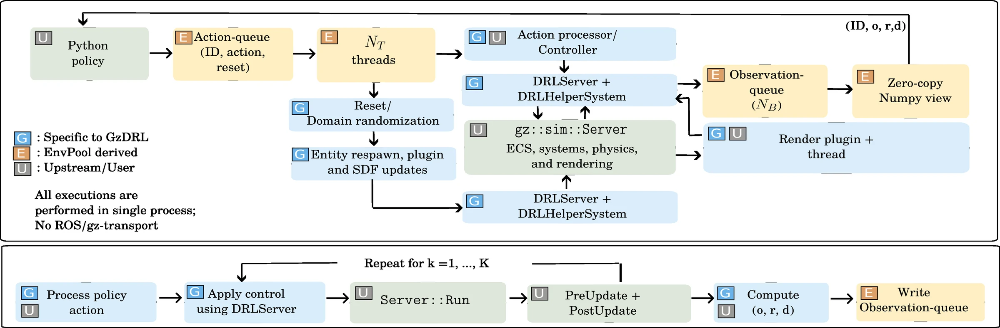
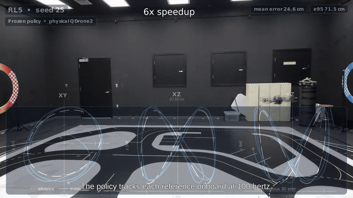
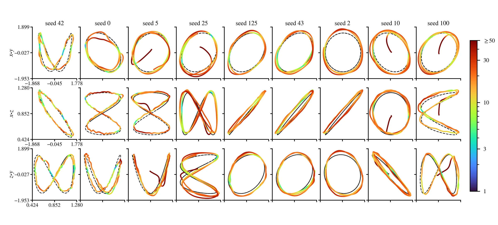

<p align="center">
  
</p>

# GzDRL: Reproducible and Scalable Deep Reinforcement Learning with Gazebo

**Amal Dev Haridevan · Junjie Kang · Jinjun Shan**

GzDRL is a single-process reinforcement learning framework for Gazebo designed for deterministic environment stepping, batched execution, and reproducible robotics RL experiments.

<p align="center">
  
</p>

<p align="center">
  <a href="https://arxiv.org/abs/2609.13243"><strong>Manuscript</strong></a>
  &nbsp;·&nbsp;
  <a href="#citation"><strong>BibTeX</strong></a>
</p>


## Getting started
Visit our documentation website for full setup details;
<p align="center">
  <a href="https://gz-drl.readthedocs.io/en/latest/"><strong>GzDRL Getting Started</strong></a>
</p>

### Requirements
- Ubuntu 22.04, 24.04
- Gazebo Harmonic, Ionic, Jetty
- Python 3.10-3.14
- GNU toolkit 11
- Optional ROS (Noetic, or any ROS 2)

### Build
Follow OSRF's
[Gazebo Jetty binary installation for Ubuntu](https://gazebosim.org/docs/jetty/install_ubuntu/):
```bash
sudo apt-get update
sudo apt-get install -y curl lsb-release gnupg
sudo curl https://packages.osrfoundation.org/gazebo.gpg \
  --output /usr/share/keyrings/pkgs-osrf-archive-keyring.gpg
echo "deb [arch=$(dpkg --print-architecture) signed-by=/usr/share/keyrings/pkgs-osrf-archive-keyring.gpg] https://packages.osrfoundation.org/gazebo/ubuntu-stable $(lsb_release -cs) main" \
  | sudo tee /etc/apt/sources.list.d/gazebo-stable.list > /dev/null
sudo apt-get update
sudo apt-get install -y gz-jetty
```
Install the non-Gazebo tools and libraries required for C++ and Python build:

```bash
sudo apt-get install -y \
  build-essential cmake gcc-11 g++-11 git python3-dev python3-venv \
  libeigen3-dev libgoogle-glog-dev
```
Clone the `gz-drl` repository and build a wheel in an isolated environment:

```bash
git clone --depth 1 https://github.com/amaldevh/gz-drl.git
cd gz-drl
python3 -m venv .venv
source .venv/bin/activate
python -m pip install --upgrade pip 
python -m pip install '.[rl, examples]' 
```
### Run an example
The script creates monitored hover environments, applies
`VecNormalize`, trains PPO, and saves checkpoints.
```bash
python examples/rl/train_vectorized_hover_policy.py
```
## Overview

Most Gazebo-based RL pipelines exchange actions and observations through ROS or Gazebo Transport. GzDRL instead interfaces directly with the Gazebo server and defines an explicit action → physics → observation sequence inside a single process.

For each environment step, GzDRL:

1. processes the policy action;
2. applies the requested control command through `DRLServer`;
3. advances Gazebo for a specified number of physics iterations using `Server::Run(1)`;
4. reads the final `PostUpdate` state and computes the observation, reward, and termination flag.

<p align="center">
  
</p>

## Main components

- **`DRLServer`** — direct interface to `gz::sim::Server` for actions, resets, model randomization, and controlled physics stepping.
- **`GazeboPool`** — EnvPool-derived C++ vectorization with environment-indexed work queues and zero-copy NumPy observations.
- **`AsyncDRLServerPool`** — Python-facing parallel execution using C++ worker threads and GIL release.
- **Runtime model randomization** — mass, inertia, actuator time constants, and plugin parameters can be modified during resets.
- **Single- and multi-agent environments** — multiple interacting robots can be represented inside one environment.
- **Gazebo-native robotics integration** — robot models, physics engines, sensors, rendering, and ROS-based deployment workflows remain available.

## Control interfaces

GzDRL supports multiple levels of control abstraction:

- rotor velocity / RPM;
- single-rotor thrust (SRT);
- collective thrust and body torque (CTBT);
- collective thrust and body rate (CTBR);
- world-frame wrench commands;
- velocity and angular-velocity commands;
- high-level state references for integrated controllers.

This allows the same simulator interface to be used for both end-to-end and modular policy architectures.

## Experiments in the manuscript

The manuscript evaluates the framework across the following settings:

- transition synchronization against ROS 2–Gazebo;
- cross-run trajectory reproducibility;
- process-isolated PPO training reproducibility;
- workstation and laptop scalability;
- multi-agent throughput with 2–20 UAVs per environment;
- trajectory-tracking and payload-transport policy training;
- runtime dynamics randomization;
- zero-shot deployment of a simulation-trained policy on a physical QDrone2.

### Selected reported results

| Experiment | Result |
|---|---:|
| GazeboPool peak throughput, workstation | **78.58 ± 2.08 × 10³ steps/s** |
| GazeboPool peak throughput, laptop | **43.38 ± 0.56 × 10³ steps/s** |
| Same-seed PPO checkpoint hashes | **100% identical** |
| QDrone2 mean Euclidean tracking error | **20.2 ± 3.4 cm** |
| QDrone2 3D RMS tracking error | **26.2 ± 7.4 cm** |
| Real-world fine-tuning for hardware experiment | **None** |

<p align="center">
  
</p>

<p align="center"><em>Hardware deployment of the frozen simulation-trained trajectory-tracking policy on QDrone2.</em></p>

<p align="center">
  
</p>


## Citation

```bibtex
@misc{haridevan2026gzdrlreproduciblescalabledeep,
      title={GzDRL: Reproducible and Scalable Deep Reinforcement Learning with Gazebo}, 
      author={Amal Dev Haridevan and Junjie Kang and Jinjun Shan},
      year={2026},
      eprint={2609.13243},
      archivePrefix={arXiv},
      primaryClass={cs.RO},
      url={https://arxiv.org/abs/2609.13243}, 
}
```
